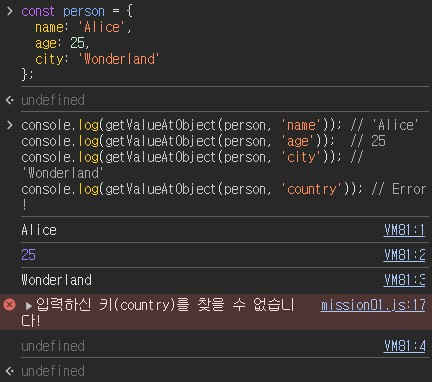
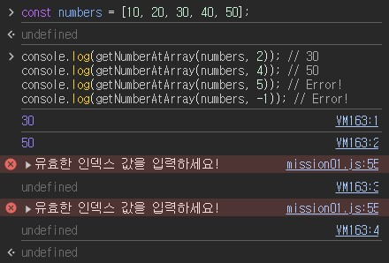

# Mission00

[**과제 바로가기 링크 (console)**](https://yzz2y.github.io/js-homework/mission00/mission00.html)

<br />

## 목차

1. **[getValueAtObject 함수](#getvalueatobject)**
1. **[getNumberAtArray 함수](#getnumberatarray)**

<br />

## getValueAtObject

### 코드 설명

```javascript
function getValueAtObject(obj, key) {

  if (key in obj) {

    return obj[key];

  } else {

    console.error(`입력하신 키(${key})를 찾을 수 없습니다!`);
    return;

  }
  
}
```

- `in`: `obj` 파라미터를 통해 입력된 객체 안에 `key` 파라미터를 통해 입력된 키 값이 존재하는지 확인하기 위한 **연산자**

- `obj[key]`: 존재할 경우 해당 키에 대응하는 값을 반환
  > **`obj.key` vs `obj[key]`**

  - `obj.key`: `obj` 객체에서 "`key`"라는 이름을 가진 키에 해당하는 값

  - `obj[key]`: `obj` 객체에서 **변수** `key`에 담긴 값을 이름으로 가지는 키에 해당하는 값

    => 대괄호 표기법(`[]`)은 대괄호 안의 **변수**의 값에 따라 **동적**으로 키를 찾는다!


- `console.error()`: 존재하지 않을 경우 에러 메세지를 띄우기 위한 메서드


### 결과 화면




<br />

## getNumberAtArray

### 코드 설명

```javascript
function getNumberAtArray(arr, index) {

  const arrayLength = arr.length;

  if (0 <= index && index <= arrayLength - 1) {

    return arr[index];

  } else {

    console.error("유효한 인덱스 값을 입력하세요!");
    return;

  }

}
```

- `arrayLength`: `arr` 배열의 길이를 **변수에 저장**

- `if` 조건부: 입력된 `index`가 `0`과 `인덱스 길이 - 1` 사이에 있는지 확인

- `console.error()`: 조건부에 입력된 범위 값을 벗어날 경우 에러 메세지를 띄우기 위한 메서드

### 결과 화면




<br />